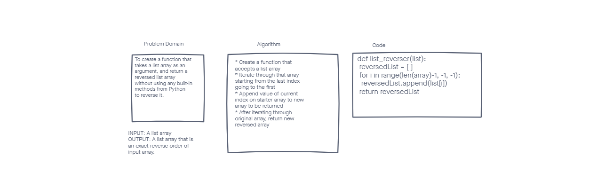

# Reverse a List
This challenge is to whiteboard a function that will take in a list, and output a list containing everything the original list did but in reverse order.

## Whiteboard Process

## Approach & Efficiency
I decided it was best to try and iterate over the array so I could do so in a way that I wanted, and push into a new list.