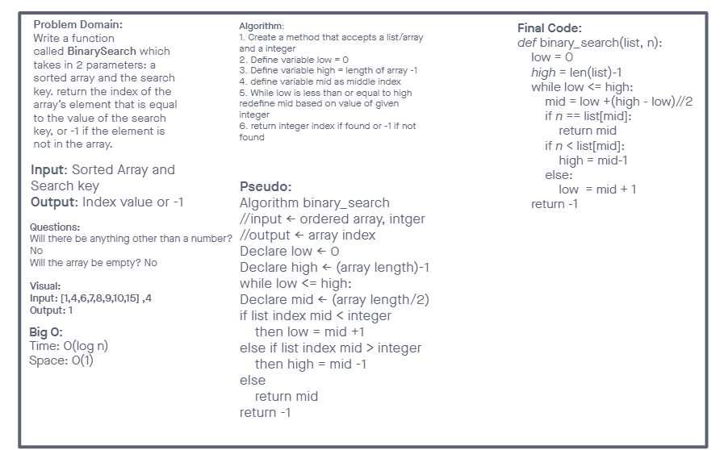

# Binary Search of Sorted List
To build a function that takes in a list and a target number, and then use binary search to search the list for the value. If the value is in the list, return the index. If not, return -1.

## Whiteboard Process

